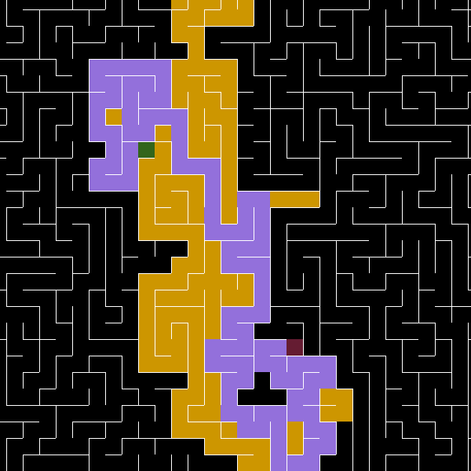

<div align="center">




# Pathfinding Algorithms Visualizer


</div> 

## Contents
* [About](#about)
* [Packages](#packages)
* [References](#references)
* [Specifications](#specifications)
* [Installation](#installation)
* [Usages](#usages)
* [Notes](#notes)

<a name="about"></a>
## About
- A visualization tool written in Python for Pathfinding Algorithms in randomly generated mazes.  

<a name="packages"></a>
## Packages
- Pygame.

<a name="references"></a>
## References
- Maze Generation Algorithms by [Wikipedia](https://en.wikipedia.org/wiki/Maze_generation_algorithm).  
- Pathfinding Algorithms by [Wikipedia](https://en.wikipedia.org/wiki/Pathfinding).  
- Graph Traversal Algorithms by [Wikipedia](https://en.wikipedia.org/wiki/Graph_traversal).  
  
<a name="specifications"></a>
## Specifications
- Iterative randomized depth-first search is used for maze generation.  
  
- The neighbor priority used: Left - Top - Right - Bottom.  
  
- Algorithms included:  
&emsp;1. <ins>Depth-first Search</ins>  
&emsp;&emsp;Explores as far as possible along each branch path before backtracking.  
&emsp;&emsp;Uses stack to store cells discovered for backtracking.  
&emsp;2. <ins>Breadth-first Search</ins>  
&emsp;&emsp;Explores all cells at the present depth prior to moving on to the cells at the next depth level.  
&emsp;&emsp;Uses queue to store cells found but not explored.  
&emsp;3. <ins>Dijkstra's Algorithm</ins>  
&emsp;&emsp;Iteratively explore cheapest cost cells with the cost being the steps to reach that cell.  
&emsp;&emsp;Uses a queue with cost included.  
&emsp;4. <ins>A* Algorithm</ins>  
&emsp;&emsp;Dijkstra's Algorithm but with heuristic using Manhattan distance.  
&emsp;&emsp;The score of each cell is the sum of the cost and heuristic.  

<a name="installation"></a>
## Installation
```
python3 -m venv env
source env/Scripts/activate
pip install -r requirements.txt
```  

<a name="usages"></a>
## Usages
- Launch ```main.py```.  
- ```Start```/```End```: Set start/end cells.
- ```Regen```: Regenerate the maze.
- ```Clear```: Clear the paths but retain the maze.  
- ```DFS```, ```BFS```, ```DIJ```, ```A*```: Select algorithm to use.

<a name="notes"></a>
## Notes
- <ins>Add</ins>: Maybe more pathfinding algorithms, selections of maze generating algorithms.


